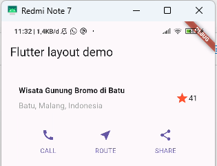

# Praktikum Flutter Layout (Jobsheet 6)

**Pemrograman Mobile**  

**Queenadhynar Azarine Dwipa Andiyani**  
**2341760109 / 28**
**SIB 3C**  

---

## Praktikum 1: Membangun Layout di Flutter
- Membuat project baru `layout_flutter`.
- Mengimplementasikan `titleSection` sesuai instruksi:
  - Kolom kiri (judul + lokasi).
  - Icon bintang merah + teks "41".
  - Seluruh baris diberi padding 32.

**Hasil Screenshot:**  

---

## Praktikum 2: Implementasi Button Row
- Membuat method `_buildButtonColumn()` untuk menampilkan ikon dan label.
- Membuat `buttonSection` berupa `Row` dengan `MainAxisAlignment.spaceEvenly`.
- Menambahkan tiga tombol: **CALL**, **ROUTE**, **SHARE**.

**Hasil Screenshot:**  

---

## Praktikum 3: Implementasi Text Section
- Membuat `textSection` menggunakan `Container` dengan padding 32.
- Menambahkan deskripsi teks panjang dengan `softWrap: true`.
- Memberikan pemisah baris (`\n`) agar teks lebih rapi.

**Hasil Screenshot:**  

---

## Praktikum 4: Implementasi Image Section
- Menambahkan folder `images/` pada root project.
- Menambahkan gambar ke `pubspec.yaml`.
- Menampilkan gambar di body dengan `Image.asset('images/lake.jpg', fit: BoxFit.cover)`.
- Mengubah body menjadi `ListView` agar mendukung scrolling.

**Hasil Screenshot:**  

---

